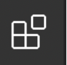

# Flask Example 03 - Simple Routes with Tests

Example 3 contains the same routes as Example 2.  The difference is the inclusion of `testRoutes.http` containing tests for the routes. To execute these, you'll need to add the `REST Client` extension in VS Code. 

## Prerequisites
- Install Thunder Client Extension in VS Code
  - Click the Extensions icon on the left 
  - In the search bar at the top, type `thunder client`. 
  - As long as results are sorted by popularity/installs, `Thunder Client` should be at the top of the list. The author is Ranga Vadhineni.  The icon is a purple lightening bolt.
  - Click on the extension, then choose `Install`.  A restart of VS Code may be required after install to load the extension. 

## To Run the Flask App
- `python app.py`

## To Test The Routes
- A new lightening bolt icon/button for Thunder Client will appear on the left bar of VS Code.  Click the Thunder Client Button
- At the top of the side bar, click `New Request`.  This will create a new tab showing the Thunder Client UI. 
- Make sure your Python App is running.  Then enter the URL in the text field next to GET.  It is probably `http://127.0.0.1:4000`. 
- Try testing some of the other routes in this example application.

## Routes
- `GET /`
  - returns a Hello World message
- `GET /bigHello`
  - returns a greeting to the user
- `GET /users/<idNumber>`
  - includes a variable in the route (`<idNumber>`) 
  - notice the variable also appears as a parameter to the function `handle_user_with_id`
  - `idNumber` is accessed with curly braces (`{}`) in the handler

